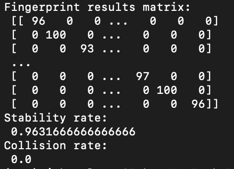

# LicenseLocking

## Paper

Our final 8-page research paper in ACM double-column format is located [here](LicenseLocking.pdf).

Over the course of this research we have also written up  our findings regarding how system clocks interact with the Unix kernel and have compiled all of the key sections of kernel code to help explain the different interactions with the timers such as the TSC and HPET.  We have included this information as an appendix in a second copy of our research paper, which can be found [here](LicenseLocking_with_appendix.pdf).

Our research was based off of the CryptoFP fingerprinting method developed by Sanchez-Rola et. al in 2018: https://www.s3.eurecom.fr/docs/ccs18_iskander.pdf

## Building and Example Usage
To build and run the fingerprinting program, run
```
$ ./build.sh
$ make
$ ./main
usage: ./main <fingerprint_filename> [-cmp]
$ time ./main ../fingerprints/fingerprint_Andrei_noload
real	5m41.165s
user	5m40.063s
sys	0m0.705s
$ time ./main ../fingerprints/fingerprint_Andrei_noload -cmp
1298 (+42 -66)/2000
fingerprint match
real	0m2.335s
user	0m2.091s
sys	0m0.244s
```

To build and run the shared array program, run the following commands under `shared-array` directory. The shared array size can be changed in `shared_array.cpp` via the ARRAY_SIZE macro
```
$ g++ -o shared_array shared_array.cpp utils.cpp -pthread
$ ./shared_array -h
Usage: ./shared_array [-m max_time_diff] [-n min_time_diff]
$ ./shared_array -m 100 -n 50
Thread 0 Start time 2977361286
Thread 1 Start time 2977361384
Start time difference range (100,50)
Time diff 98
Total execution 10
Result:
1 1 1 1 1 1 1 1 1 1 1 1 1 1 1 1 1 1 1 1 1 1 1 1 1 1 1 1 1 1 1 1 1 1 1 1 1 1 1 1 1 1 1 1 1 1 1 1 1 1 1 1 1 1 1 1 0 0 0 0 0 1 1 1 1 1 1 1 1 1 1 1 0 0 0 0 0 1 1 1 1 1 1 1 1 1 1 1 1 1 1 1 1 1 1 1 1 1 1 1 1 1 1 1 1 1 1 1 0 0 0 0 1 1 1 1 1 1 1 1 1 1 1 1 1 1 1 1 1 1 1 1 1 1 1 1 1 1 1 1 1 1 1 0 0 0 0 0 0 0 0 0 0 0 0 0 0 0 0 0 0 0 0 0 0 0 0 0 0 0 0 0 0 0 0 0 0 0 0 0 0 0 0 0 0 0 0 0 0 0 0 0 0 0 0 0 0 0 0 0 0 0 0 0 0 0 0 0 0 0 0 0 0 0 0 0 0 0 0 0 0 0 0 0 0 0 0 0 0 0 0 0 0 0 0 0 0 0 0 0 0 0 0 0 0 0 0 0 0 0 0 0 0 0 0 0 0 0 0 0 0 0 0 0 0 0 0 0 0 0 0 0 0 0 0 0 0 0 0 0 0 0 0 0 0 0 0 0 0 0 0 0 0 0 0 0 0 0 0 0 0 0 0 0 0 0 0 0 0 0 0 0 0 0 0 0 0 0 0 0 0 0 0 0 0 0 0 0 0 0 0 0 0 0 0 0 0 0 0 0 0 0 0 0 0 0 0 0 0 0 0 0 0 0 0 0 0 0 0 0 0 0 0 0 0 0 0 0 0 0 0 0 0 0 0 0 0 0 0 0 0 0 0 0 0 0 0 0 0 0 0 0 0 0 0 0 0 0 0 0 0 0 0 0 0 0 0 0 0 0 0 0 0 0 0 0 0 0 0 0 0 0 0 0 0 0 0 0 0 0 0 0 0 0 0 0 0 0 0 0 0 0 0 0 0 0 0 0 0 0 0 0 0 0 0 0 0 0 0 0 0 0 0 0 0 0 0 0 0 0 0 0 0 0 0 0 0 0 0 0 0 0 0 0 0 0 0 0 0 0 0 0 0 0 0 0 0 0 0 0 0 0 0 0 0 0 0 0 0 0 0 0
```

## Configuration Changes
The fingerprinting clocksource can be configured via the CLOCKSOURCE variable
```
enum Clocksource { TSC,
    HPET };
constexpr Clocksource CLOCKSOURCE = TSC;
```
in `fingerprint.h` to either TSC or HPET. In TSC mode, the implementation attempts to measure the quotient of two TSC-related measurements. In HPET mode, absolute HPET-related measurements are used.
Also in `fingerprint.h` are
```
constexpr double threshold = 0.5;
constexpr long long sensitivity = 1000;
```
which control the fingerprint-similarity threshold and size of the measured subproblems respectively. For a more detailed description, see the header file.

The size of the fingerprinting matrix (i.e. number of measurements and repeats) is controlled from `utils.h`:
```
constexpr int n = 1000;
constexpr int m = 50;
```
These parameters are taken from the paper. I recommend AGAINST modifying these parameters if using encryption. If you must modify them, however, please look at the `FINGERPRINT_HASH_LINE` constant as well, and be mindful of the linear increase in encryption time with the number of measurements. Increasing that constant leads to a blow-up in memory usage too. Whether or not encryption is used for the fingerprints is decided within `crypto.h`:
```
constexpr bool ENCRYPT = true;
```
For testing different fingerprinting methods and their respective accuracies, I recommend setting this flag to `false`. Otherwise, the base fingerprint takes several minutes.

## Encryption

At a very high level, the fingerprints are embedded into a different space (each row is hashed with a function from an m-wise independent hash family, into a slightly larger hash table; think of a Bloom Filter with 1 function; different weights are applied to different elements, to give meaning to the dot product of two hashes), where fingerprint similarity is closely related to the dot-product. These embeddings are encrypted using FHIPE (Function Hiding Inner-Product Encryption), which allows us to recover the dot-product from encrypted data without leaking more information. This dot-product is then interpreted into a similarity score. This score is biased (because of collisions introduced by the original embedding), so bias-correction is applied. Encryption uses the CiFEr library (installed by the `build.sh` script).

## Testing

On one single machine, the fingerprint, measured on the same operating system (Ubuntu 22.04.3 LTS), is stable
across measurements performed at random times within 14 days of fingerprint generation. The fingerprint stability 
is preserved between battery/charging modes, frequency-affecting power modes (performance, balanced, power saving)
and system load variations. Running the fingerprinting routine with CPU affinity under light load
```
$ ./taskset_test.sh --fp=./fingerprints/fingerprint_Andrei_noload --test_count=1000 --stress=0
cpu 0: 4/1000 failed
cpu 1: 4/1000 failed
cpu 2: 3/1000 failed
cpu 3: 4/1000 failed
cpu 4: 2/1000 failed
cpu 5: 4/1000 failed
cpu 6: 6/1000 failed
cpu 7: 2/1000 failed
cpu 8: 0/1000 failed
cpu 9: 2/1000 failed
cpu 10: 0/1000 failed
cpu 11: 5/1000 failed
```
reveals a large probability (99.5%) of success in matching a fingerprint formerly measured also under light load. 
Running the same tests with a 100% load on all available cores
```
$ ./taskset_test.sh --fp=./fingerprints/fingerprint_Andrei_noload --test_count=1000 --stress=1
cpu 0: 0/1000 failed
cpu 1: 1/1000 failed
cpu 2: 3/1000 failed
cpu 3: 0/1000 failed
cpu 4: 0/1000 failed
cpu 5: 0/1000 failed
cpu 6: 0/1000 failed
cpu 7: 1/1000 failed
cpu 8: 0/1000 failed
cpu 9: 0/1000 failed
cpu 10: 0/1000 failed
cpu 11: 0/1000 failed
```
reveals that our fingerprinting method remains stable even at extreme loads. It is also a great way to drain your laptop battery.

An example of our output returned from our full AWS EC2 test suite is included below.  Note the high stability rate of over 96.3% and the collision rate of 0%, indicating that our fingerprinting algorithm has 100% discrimination power and provides a strong basis for license locking.




